  

 

# 👋 Hi, I'm Navya!

### 💻 CSE (Applied AI) Student

### 🤖 AI & Data Science Enthusiast • 🚀 Developer • ✨ Open Source Contributor

Welcome to my GitHub! I'm **Navya**, a **B.Tech Computer Science Engineering (Applied AI)** student at **St. Joseph’s University, Chennai**.

I'm passionate about **Artificial Intelligence, Data Science, Software Development, and problem-solving**. I enjoy building practical projects, exploring new technologies, and contributing to open-source projects.

---

## ✦ ABOUT ME

<table>
<tr>

<td width="50%" valign="top">

### 🎓 Education

Pursuing **B.Tech CSE (Applied AI)**

</td>

<td width="50%" valign="top">

### 🤖 Artificial Intelligence

Exploring **Artificial Intelligence & Machine Learning**

</td>

</tr>

<tr>

<td width="50%" valign="top">

### 📊 Data

Interested in **Data Science & Data Analysis**

</td>

<td width="50%" valign="top">

### 💻 Development

Building projects with **Python, JavaScript, React & SQL**

</td>

</tr>

<tr>

<td width="50%" valign="top">

### 🌐 Web Development

Exploring **modern Web Development**

</td>

<td width="50%" valign="top">

### 🐙 Open Source

Contributing to and learning from **Open Source**

</td>

</tr>

<tr>

<td width="50%" valign="top">

### 🧠 Problem Solving

Practicing **Data Structures & Algorithms**

</td>

<td width="50%" valign="top">

### 🔧 Git & GitHub

Working with **Git, GitHub and collaborative workflows**

</td>

</tr>

<tr>

<td width="50%" valign="top">

### 🎨 Creative Technology

Interested in **Art, Design & Creative Technology**

</td>

<td width="50%" valign="top">

### ✨ Growth

Always **learning, building, and improving**

</td>

</tr>

</table>

---

## ⚡ TECH STACK

### Languages

  

### Frameworks & Libraries

  

### Tools & Platforms

### Areas of Interest

`Artificial Intelligence` • `Data Science` • `Machine Learning`
`Web Development` • `Open Source` • `Problem Solving`

---

## ◈ FEATURED PROJECTS

<table>
<tr>

<td width="50%" valign="top">

### 🛒 QuickCart

A lightweight **shopping cart application built with React**, focused on creating a simple and interactive shopping experience.

**React • JavaScript**

</td>

<td width="50%" valign="top">

### 🌐 Auto-Annotated Portfolio

A **TypeScript-based portfolio project** focused on presenting personal projects and information through a modern web experience.

**TypeScript • Web Development**

</td>

</tr>

<tr>

<td width="50%" valign="top">

### 👥 Squad Portfolio

A collaborative portfolio project created to showcase **team members, projects, skills, and achievements**.

**Web Development • Collaboration**

</td>

<td width="50%" valign="top">

### 🧩 Mini Web Projects

A collection of small web development projects created to practice **HTML, CSS, UI design, and front-end development concepts**.

**HTML • CSS • JavaScript**

</td>

</tr>

<tr>

<td width="50%" valign="top">

### 🐍 Python Problem Solving

A collection of Python solutions covering **programming fundamentals, algorithms, logical problem-solving, and coding practice**.

**Python • DSA • Problem Solving**

</td>

<td width="50%" valign="top">

### 💼 Portfolio Website

My personal portfolio website showcasing my **skills, projects, achievements, and learning journey**.

**Web Development • Design**

</td>

</tr>

<tr>

<td width="50%" valign="top">

### 🔧 GitHub Practice

A repository created to strengthen my understanding of **Git, GitHub, repositories, commits, branches, and collaborative workflows**.

**Git • GitHub • Collaboration**

</td>

<td width="50%" valign="top">

### 🚀 More Projects

Continuously experimenting with **new ideas, technologies, and practical projects**.

**Build • Learn • Improve**

</td>

</tr>
</table>

---

## ⟡ OPEN SOURCE CONTRIBUTIONS

I've also explored and contributed to real-world open-source projects, gaining experience with **collaborative development and professional Git workflows**.

| Project            | What I Explored                                                         |
| ------------------ | ----------------------------------------------------------------------- |
| 🔹 **Mathesar**    | Open-source spreadsheet-like interface for working with PostgreSQL data |
| 🔹 **Hugo Docs**   | Documentation and open-source development workflows                     |
| 🔹 **Material UI** | React component library and Material Design                             |
| 🔹 **tldr**        | Collaborative command-line cheatsheet project                           |

These projects have helped me understand **issues, branches, pull requests, repositories, documentation, code collaboration, and open-source contribution workflows**.

---

## ◌ CURRENTLY LEARNING

🤖 **Artificial Intelligence & Machine Learning**

📈 **Data Science & Data Analysis**

⚛️ **React & Front-End Development**

🐍 **Python & JavaScript**

🧩 **Data Structures & Algorithms**

🌐 **Full-Stack Development**

🔓 **Open-Source Contribution**

---

## ◎ GOALS

✨ Build meaningful real-world projects

 

✨ Grow my skills in AI and software development

 

✨ Make more open-source contributions

 

✨ Improve my problem-solving abilities

 

✨ Collaborate with developers and learn from the community

 

✨ Keep experimenting with new technologies

---

## 📊 GITHUB ACTIVITY

---

## 💻 LEETCODE

  

**@navya_d16**

---

## 📫 CONNECT WITH ME

---

## 💡 MY PHILOSOPHY

### **Learn continuously. Build consistently. Create something meaningful.** 🚀

---

  

⭐ **Feel free to explore my repositories, check out my projects, and connect with me!**

 

### Thanks for visiting my GitHub! 💜

